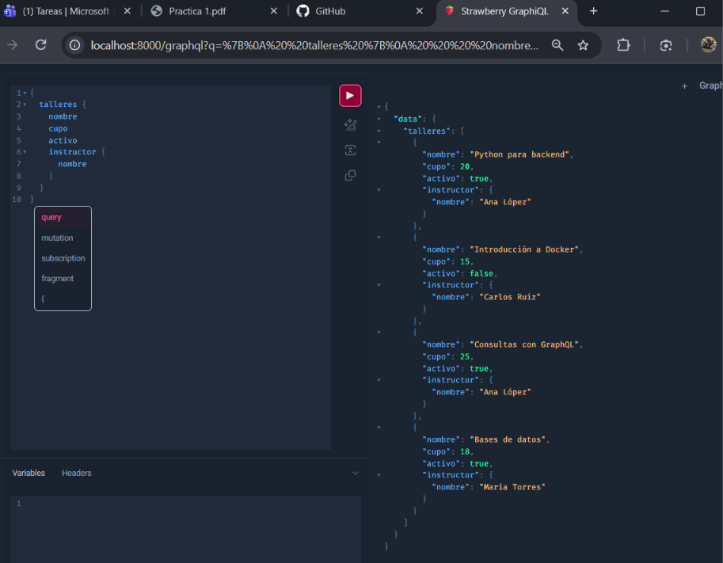
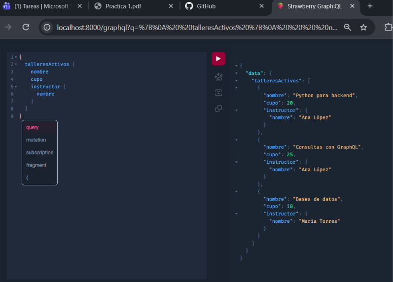
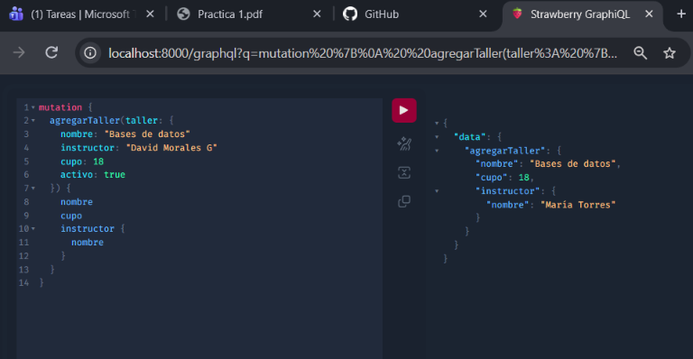
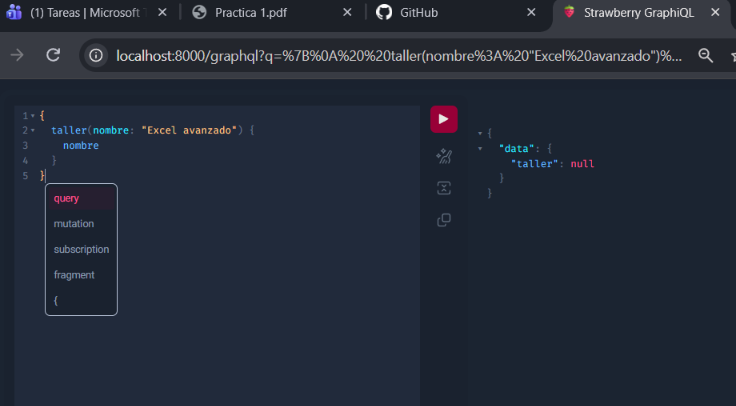

# Práctica 1 - Fundamentos de Arquitectura de Software y Desarrollo Backend

Proyecto correspondiente a la práctica de la Unidad I de la asignatura Fundamentos de Arquitectura de Software y Desarrollo Backend.

## Descripción

El proyecto contiene dos ejercicios independientes:

- Una API REST desarrollada con FastAPI, SQLAlchemy, MySQL y Docker para administrar un inventario de laptops.
- Un servidor GraphQL desarrollado con Strawberry para administrar un catálogo de talleres.

Los dos ejercicios funcionan de manera independiente, tal como se solicita en la práctica.

## Tecnologías utilizadas

- Python
- FastAPI
- SQLAlchemy
- MySQL
- PyMySQL
- Docker
- Docker Compose
- GraphQL
- Strawberry

## Estructura del proyecto

    examen_rest/
    ├── main.py
    ├── database.py
    ├── models.py
    ├── requirements.txt
    ├── Dockerfile
    └── compose.yaml

    examen_graphql/
    └── schema.py

    evidencia/
    ├── 01_graphql_talleres_iniciales.png
    ├── 02_graphql_talleres_activos.png
    ├── 03_graphql_agregar_taller.png
    └── 04_graphql_taller_no_encontrado.png

## Ejercicio 1 - API REST

La API administra laptops almacenadas en MySQL mediante SQLAlchemy.

Endpoints principales:

- `GET /`
- `GET /laptops`
- `GET /laptops/disponibles`
- `GET /laptops/{laptop_id}`
- `POST /laptops`

La API se ejecuta mediante Docker Compose junto con el servicio de MySQL.

Para iniciar el ejercicio:

    cd examen_rest
    docker compose up --build

La documentación interactiva de FastAPI queda disponible en:

    http://localhost:8000/docs

## Ejercicio 2 - GraphQL

El segundo ejercicio utiliza Strawberry para crear un servidor GraphQL independiente de FastAPI.

El servidor contiene consultas para:

- Obtener todos los talleres.
- Buscar un taller por nombre.
- Obtener únicamente los talleres activos.
- Agregar nuevos talleres mediante una mutación.

Para iniciar el servidor:

    cd examen_graphql
    strawberry dev schema

GraphiQL queda disponible en:

    http://localhost:8000/graphql

## Evidencia

Se incluyen capturas de las principales pruebas realizadas en GraphiQL.

### Talleres iniciales

### Talleres activos

### Agregar taller

### Taller no encontrado

## Autor

David Morales.